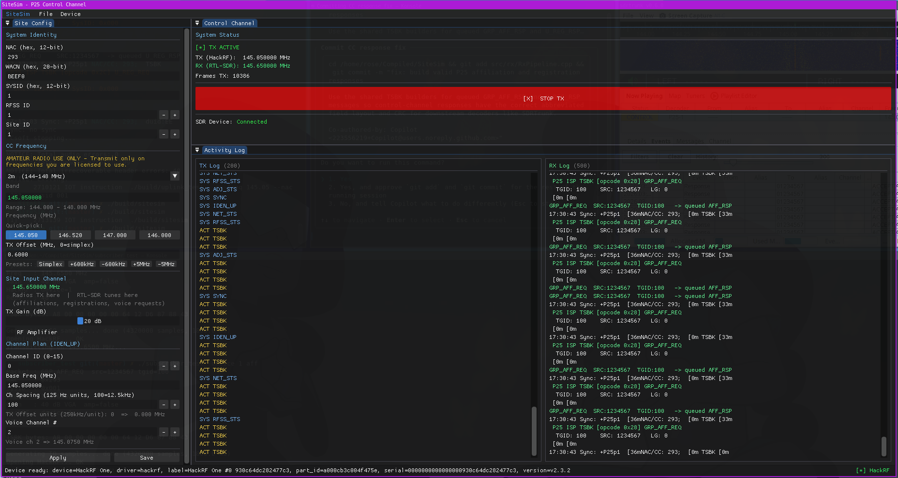

# SiteSim

`SiteSim` is a P25 Phase 1 site simulator focused on the two core halves of a trunked site:

- the **downlink control channel** transmitted by the site
- the **uplink / ISP path** transmitted by subscriber radios back to the site

The goal of the project is to let you stand up a small, understandable P25 site model, watch what it is doing, and test subscriber behavior against it.

## How the project is split up

### `sitesim`

This is the main application.

It has a GUI for configuring a site, starts the control channel transmitter, runs the uplink receiver, and shows both TX and RX activity logs at the same time.

### `uplink_test`

This is the uplink receiver path pulled out into a standalone tool.

It exists so the `dsd-neo`-based receive chain can be tested by itself, without involving the rest of the GUI application or control-channel transmitter.

### `subscriber_test`

This is a standalone subscriber-side test transmitter.

It sends mobile-originated P25 ISP messages with a HackRF so the uplink receiver can be exercised without a real subscriber radio.

## How SiteSim works

## 1. Control channel transmission

The control channel side continuously emits a P25 Phase 1 control stream.

It rotates through core system broadcasts that a subscriber expects to see on a live control channel, including things like:

- identifier updates
- network status
- RFSS status
- adjacent site status
- synchronization broadcast

When uplink activity causes the site to need to answer something, SiteSim queues a response TSBK into the control-channel scheduler. That queued message is then inserted into the outgoing control-channel stream and transmitted as part of the normal burst flow.

## 2. Uplink reception

The receive side uses an RTL-SDR and `dsd-neo` in P25 ISP mode.

In this mode, the site listens for mobile-originated TSBKs on the uplink frequency and interprets them as subscriber-to-site requests rather than site-to-subscriber traffic.

Examples of uplink traffic the receiver understands:

- group affiliation requests
- unit registration requests
- group voice channel requests
- unit-to-unit voice channel requests
- emergency alarm requests

The RX path logs raw sync/status information from `dsd-neo`, then forwards decoded ISP events into SiteSim’s own RX log.

## 3. Automatic site responses

When a valid uplink request is decoded, SiteSim can generate a matching control-channel response automatically.

For example:

- a `GRP_AFF_REQ` can cause a `GRP_AFF_RSP` to be queued
- a `U_REG_REQ` can cause a `U_REG_RSP` to be queued

This means the uplink side and downlink side are tied together: subscriber actions heard on the uplink can immediately drive site behavior on the control channel.

## 4. Frequency model

The site configuration carries both the control-channel transmit frequency and the uplink receive frequency relationship.

`SiteSim` models this using a control-channel frequency plus an offset. That makes it possible to represent:

- the frequency the site is transmitting on
- the frequency subscriber units are expected to transmit back on

This matters because the control channel and the uplink receiver are not necessarily listening on the same RF frequency.

## How `uplink_test` fits in

`uplink_test` is the same receive concept without the full application wrapped around it.

Its job is simple:

- tune the RTL-SDR
- run the `dsd-neo` uplink decode path
- print sync and decoded ISP traffic

That makes it useful for isolating problems. If `subscriber_test` works against `uplink_test`, then the subscriber-side modulation and the raw uplink decoder are both basically correct before bringing the full GUI application back into the loop.

## How `subscriber_test` works

`subscriber_test` builds a complete P25 Phase 1 TSBK frame and modulates it for HackRF transmission.

Internally it does the same low-level work the main app does for control-channel messages:

- builds the ISP TSBK payload
- applies CRC
- trellis encodes and interleaves it
- wraps it in a P25 frame with sync and NID
- inserts status symbols
- C4FM modulates the dibits into IQ samples

It then transmits repeated copies of that frame so the receive side has time to lock and decode.

## Typical validation flow

The project is normally exercised in stages:

1. Prove the uplink decoder works with `uplink_test`.
2. Prove `subscriber_test` can generate valid ISP traffic.
3. Move back to full `sitesim`.
4. Confirm that an uplink request seen in the RX log results in a matching downlink response seen on the control channel.

## Current intent of the codebase

The codebase is centered on practical P25 site simulation, not a full generalized trunking stack.

The emphasis is on:

- making control-channel behavior visible
- making uplink traffic easy to inspect
- validating subscriber interactions end-to-end
- keeping the tooling approachable enough to test without real subscriber hardware
